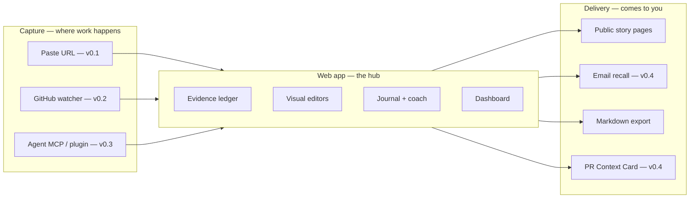

# How It Works — Interaction Model and Platform Strategy

**Companions:** `OPEN_SOURCE_CONTRIBUTION_JOURNAL_SPEC.md` (product design), `SPEC_V0.1.md` (first buildable scope), `docs/adr/` (architecture decisions)
**Purpose:** Answer three questions the other documents left open: where does the product live, what happens automatically when the user opens a PR, and how does learning actually work beyond text
**Status:** Proposed. Section 9 lists the load-bearing technical assumptions for independent verification.
**Date:** July 2026

---

# 1. The Interaction Model in One Paragraph

The product is a **hub with spokes**. The web application is the hub: system of record, visual editors, story pages. Capture spokes bring work in from where it actually happens — pasting a URL, a GitHub activity watcher, and an agent integration for Claude Code / Codex. Delivery spokes push learning out to where the user already is — public story pages, email recall, Markdown export. The user never has to remember to journal: the system notices their work and brings them a four-minute task. **Capture where the work happens. Reflect where visuals work. Recall where the user already is.**



---

# 2. Where the Product Lives

| Surface | What it does | What it cannot do | Version |
|---|---|---|---|
| **Web app** (`apps/web`) | Evidence ledger, editable diagrams, journal, dashboard, story pages, account | Capture work at the source; reach the user unprompted | 0.1 |
| **GitHub watcher** (server-side) | Detects PRs the user opens anywhere on GitHub; creates private drafts; syncs review activity | See the user's reasoning process — GitHub only records artifacts | 0.2 |
| **Agent integration** (MCP server + Claude Code plugin) | Captures hypotheses, dead ends, and test outcomes from the coding session itself | Render visual maps; share; schedule recall | 0.3 |
| **Email recall** | Delivers one retrieval question per scheduled review; one click to answer | Anything requiring the full workspace | 0.4 |
| **PR Context Card** (GitHub App, maintainer-side) | Posts a structured understanding card on PRs in repos that opted in | Anything without maintainer opt-in | 0.4 |
| **Public story pages** | Server-rendered, no account needed, Open Graph images | — | 0.1 |

## 2.1 Why not website-only

A standalone website requires the user to remember to visit it after every PR, at the exact moment they are most depleted. That habit does not form. Push-based capture is not an enhancement; it is the answer to the product's single riskiest assumption.

## 2.2 Why not plugin-only

A terminal plugin has the best capture position and the worst everything else: no editable visual maps, no shareable artifact, no growth loop, no push channel for recall, single-platform. A plugin-only product is a personal script. The plugin **feeds** the hub; it does not replace it.

The asymmetry in one line: **the plugin is where the knowledge is; the web is where the learning happens.**

---

# 3. A Day in the Life (target experience, v0.3)

Each step is tagged with the version that makes it real.

1. **You work.** In Claude Code, journal MCP connected, you investigate an `IntersectionObserver` bug in `payloadcms/payload`. As you work, the capture tool silently logs *locally*: 14 files explored, hypothesis 1 ("lazy-load threshold too low") rejected after a failing test, hypothesis 2 ("observer never disconnects on unmount") confirmed, 3 test runs — one failure, two passes after the fix. **(v0.3)**

2. **You open the PR** from the terminal, as you always do. Nothing else to remember. **(—)**

3. **~10 minutes later**, the watcher sees the `PullRequestEvent` in your public activity feed. It imports the PR via one cached GraphQL call, builds the timeline, drafts the problem-to-solution map — and if a session capture exists for this branch, your two hypotheses are already on the map as candidate nodes marked *"from your session."* You get one email: **"Draft story ready for payload#9137 — about 4 minutes to finish."** The draft is private. **(v0.2; session merge v0.3)**

4. **You spend four minutes.** The coach asks its explain-first questions before revealing the drafted map ("What do you think the root cause was?"). Then the draft appears; two nodes are flagged *inferred*; you correct one label, confirm the rest, done. **(coach v0.2; drafting v0.1)**

5. **Review happens on GitHub**, where it should. The maintainer requests a real-browser test instead of the mocked observer. The watcher syncs the review thread into your workspace and appends a review-evolution node: feedback → your interpretation → change → evidence. Your dashboard shows *needs response* — framed as learning, not as an inbox. **(v0.2)**

6. **The PR merges.** One loop-close email: two-minute final reflection, and the recall schedule is set. **(v0.2)**

7. **Day 3, 7, 21.** An email arrives with a single question: *"Why did the maintainer reject the mocked-observer test?"* One click, answer on a one-question page, corrective feedback shown. The day-7 session asks you to **redraw the problem-to-solution map from memory**, then diffs your reconstruction against the confirmed one. **(v0.4)**

8. **Anytime**, you publish the story — public page, Open Graph image, evidence-linked. Your concept graph quietly gains `IntersectionObserver lifecycle` → linked to this PR and to the Payload contribution from March. **(publish v0.1; concept graph v0.4)**

Total demanded attention after the PR: **about six minutes, delivered to you.** That is the product.

---

# 4. Direct Answer: "Does Every PR Show Up Somewhere?"

| Event | v0.1 | v0.2 | v0.3+ |
|---|---|---|---|
| You open a PR anywhere | Nothing automatic — you paste the URL | Private draft on your dashboard + one email | Same, enriched with session capture |
| Review comments / new commits | Manual re-import | Auto-synced while the contribution is open | Same |
| PR merged or closed | Manual | Loop-close prompt + recall scheduling | Same |
| Visible to anyone else | Only on explicit publish | Same | Same |
| Anything on GitHub itself | Never | Never | Only the PR Context Card, only in repos whose maintainers installed it |

Invariants, restated from ADR `0002` and the parent spec §5.6: private by default, publishing is always explicit, the app holds **zero GitHub write permissions** in every version before the opt-in maintainer App — so it is *incapable* of posting anything as you.

## 4.1 How auto-detect works without installing anything

You cannot install an app on a repository you do not own — which is every repository you contribute to. But GitHub exposes each user's public activity feed (`GET /users/{username}/events/public`), which includes a `PullRequestEvent` for every PR you open in any public repository. The watcher polls this feed with your OAuth token (delay up to ~5 minutes, ETag-cached so unchanged polls are free), and a new event triggers the normal import pipeline from ADR `0001`.

Discovery and sync are separate mechanisms: the events feed only *triggers*; tracked contributions that are still open re-sync via the cached GraphQL importer on a schedule and on manual refresh. Private-repo activity does not appear in the public feed — consistent with the public-only scope of v0.1–0.2.

---

# 5. The Agent Plugin Strategy (Claude Code / Codex)

This is the most on-thesis feature in the product. The parent spec's founding observation (§2) is that the real knowledge — failed hypotheses, dead ends, what the tests actually showed — *"disappears into a long conversation, an agent transcript, temporary notes, or memory."* GitHub never sees any of it; it records artifacts, not process. The agent session is the **only place the process exists**, and an in-agent capture tool is the only thing positioned to save it.

## 5.1 One MCP server covers every agent

The base integration is a single MCP server (working name: `osj`), because MCP is the one protocol Claude Code, Codex CLI, Cursor, and Windsurf all speak. Build once, run everywhere the user works.

Illustrative tool surface (final API decided at build time):

```
osj.log_hypothesis(text, status)     # "observer never disconnects" → confirmed
osj.log_check(command, outcome)      # test run, repro attempt, benchmark
osj.capture_session()               # end of session → writes LOCAL capture file
osj.attach(pr_url)                   # link a reviewed capture to a contribution
```

## 5.2 Claude Code gets an enhanced tier

A Claude Code **plugin** bundles: the MCP server config, a skill that teaches the agent *when* to log (during debugging, on hypothesis changes, after test runs), and a session-end hook that offers "capture this session?" deterministically rather than hoping the model remembers. Distributable through the plugin marketplace. Codex CLI gets the MCP server plus an `AGENTS.md` instruction to call `capture_session` when a task ends — less deterministic (no hook guarantee), acceptable.

## 5.3 The privacy rule for session capture

Agent transcripts can contain secrets, private code, and half-formed thoughts. Therefore, non-negotiable:

- Capture writes to a **local file only**. Nothing leaves the machine at capture time.
- Attaching to a contribution requires an explicit review step — the user sees exactly what would upload, with token-shaped strings pre-redacted (same redaction pass as ADR `0001` import).
- Per-repo opt-in; no global silent capture.

This extends the parent spec's evidence-consent stance (§14.2, §24) to a new evidence source. Session captures enter the evidence ledger as `EvidenceKind: "terminal_output"` / `"user_note"` artifacts with provenance, like everything else.

## 5.4 Sequencing note

This slots in as **v0.3**, which reorders the original roadmap — agent capture moves ahead of the maintainer-side GitHub App (now v0.4). Reasons: the MCP server is a thin wrapper over the same API the web app uses (~1–2 weeks) while the GitHub App is a 3–4 week build with webhook infrastructure and anti-spam obligations; and capture makes every story richer, which improves the very artifact the maintainer App would later amplify. Distribution engine after the thing worth distributing.

---

# 6. Why It Is Not "Just Text"

The concern is correct: a text journal that gets written once and reread never teaches little (parent spec §38 — rereading is among the weakest study behaviors). The design answer is that **the diagram is the object and text is the annotation**. The journal's spine is the three editable maps; prose hangs off their nodes. The research the spec already cites supports exactly this: self-explaining *diagrams* outperformed self-explaining text (Ainsworth & Loizou), and retrieval practice beats re-exposure (Agarwal et al.).

Four learning surfaces, strongest first:

| # | Surface | What it looks like | Why it works | Version |
|---|---|---|---|---|
| 1 | **In-flow coaching** | The agent asks "why do you think this test failed?" *while you are debugging*; your answer becomes a hypothesis node | Elaboration at the moment of maximum context — no after-the-fact tool can ever have this position | 0.3 |
| 2 | **Editable visual maps** | AI drafts; you correct wrong nodes; correcting requires understanding | Self-explanation with diagrams; error correction is inferential work, not transcription | 0.1 |
| 3 | **Active recall, pushed** | One emailed question per session; day-7 includes *redrawing the map from memory*, diffed against the confirmed version | Retrieval practice with feedback; diagram reconstruction is visual recall, not text recall | 0.4 |
| 4 | **Teach-back, voice** | Explain the contribution aloud; transcript checked for missing concepts and unsupported claims | Generation effect; speaking prevents copy-paste self-deception | later |

Explicit anti-goal, worth stating because every journaling tool dies here: **the journal is not for rereading.** It is the substrate that recall sessions and the concept graph draw from. If a feature's usage pattern is "open and passively reread," it is decoration.

---

# 7. Technical Mechanics Summary

For the reader who wants the one-screen version of how the spokes run:

- **Discovery:** poll `GET /users/{me}/events/public` per signed-in user (ETag-cached; unchanged polls cost nothing against the limit). `PullRequestEvent` → import pipeline (ADR `0001`) → private draft → one email.
- **Sync:** contributions in stage `pull_request_open`/`in_review` re-import on a schedule and on webhook-less manual refresh; cached GraphQL keeps this cheap; syncing stops at `completed`.
- **Session capture:** local JSON per session; explicit review + redaction gate before anything uploads; becomes evidence artifacts with provenance.
- **Recall delivery:** transactional email, one question per message, answer on a one-question web page (no inline reply parsing — deliverability-fragile and unnecessary).
- **Notification budget:** hard cap of one email per contribution state change (draft ready, needs response, loop-close, recall due). No digests of digests, no streaks, no re-engagement spam. The product's credibility with developers depends on this.

---

# 8. Optional Week-0 Hack (Before Any Product Code)

Worth one day of work, this week: a **personal Claude Code skill** that, at session end, writes a `NotesOpenSourceFiles`-style Markdown journal — problem, hypotheses, root cause, Mermaid problem-to-solution sketch — from the transcript into a local folder.

It is not the product. It has no UI, no server, no sharing. Its value: your next five contributions generate real capture data, which becomes the dogfood corpus (parent spec §29) and answers empirically *which session data is actually worth capturing* before v0.3 is designed. Throw it away afterward by design; do not let it grow features.

---

# 9. Load-Bearing Assumptions to Verify

This document makes factual claims that should survive an independent check. Numbered for a second-model verification pass; each is falsifiable.

1. **GitHub Events API:** `GET /users/{username}/events/public` includes `PullRequestEvent` for PRs the user opens in public repositories; delay may reach ~5–6 minutes; feed retains ~90 days / 300 events; ETag-conditional polls returning `304` do not count against the rate limit.
2. **No user-level webhook:** GitHub offers repo and org webhooks only; there is no webhook for "this user's activity across arbitrary repositories," so polling is the correct mechanism for v0.2 auto-detect.
3. **GraphQL single-call import:** one query can fetch PR + reviews + review threads + commits + changed-file metadata + timeline items within node limits for typical PRs (pathological PRs need pagination), at a point cost far below the equivalent ~11–26 REST calls (ADR `0001`).
4. **REST conditional requests:** `304 Not Modified` responses do not count against the primary rate limit.
5. **MCP coverage:** Claude Code, Codex CLI, Cursor, and Windsurf all support user-configured MCP servers as of mid-2026.
6. **Claude Code plugin mechanics:** plugins can bundle skills + hooks + MCP config; a session-end/stop hook receives the transcript path and can trigger a local command — sufficient for the §5.2 capture flow. (Verify exact hook names and payload fields against current docs.)
7. **OG image generation:** dynamic Open Graph images per story page are cheap and standard (satori/`@vercel/og`-class tooling or equivalent self-hosted).
8. **Email recall:** one-click answer links via a transactional provider are sufficient; no inline-reply parsing is assumed anywhere.
9. **Competitive claim:** as of July 2026 no established tool converts *agent-session process data plus GitHub evidence* into a learning artifact. Adjacent tools exist (contribution dashboards, changelog/brag-doc generators, repo visualizers — parent spec §3.1). **This is the shakiest claim in the document; search before relying on it.**
10. **Inference cost:** drafting two maps per import at current model pricing stays within a sustainable free anonymous tier under the ADR `0001` quotas. Re-check against current provider pricing.

---

# 10. Open Product Questions

Genuinely open — none block v0.1:

- **Capture aggressiveness:** should the agent log hypotheses proactively by default, or only on explicit `/journal` invocation? (Leaning: explicit until the week-0 hack shows what passive capture is worth.)
- **Draft-first vs. explain-first tension:** the v0.2 coach asks questions before revealing the draft the v0.2 watcher already built. Does knowing a draft exists reduce effortful recall? Measurable in 0.2 (ADR `0003` §Note).
- **Auto-draft completion rate:** do watcher-created drafts get finished at a lower rate than deliberately pasted ones? If yes, notification copy and timing matter more than features.
- **Monorepo home for the agent surface:** `apps/cli` (ships the MCP server) is the working assumption; decide at v0.3.
- **Naming:** `osj` is a placeholder throughout.
