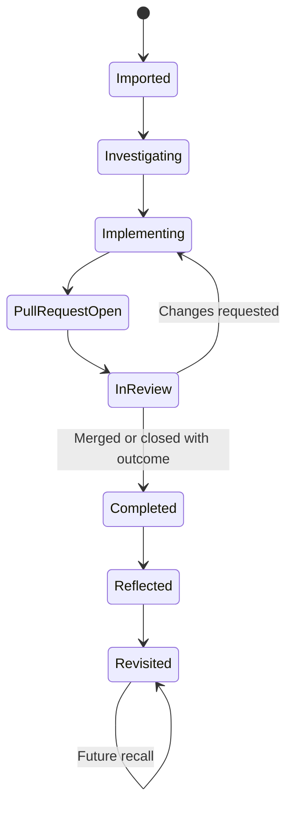
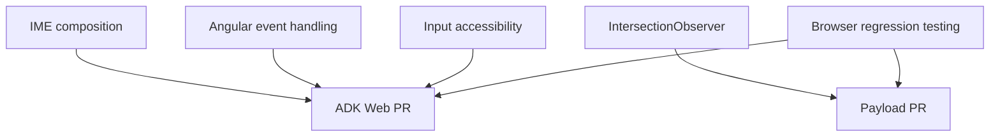
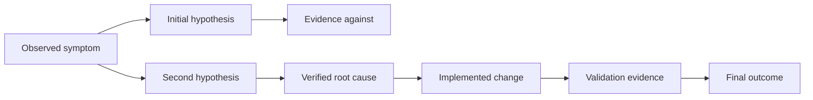
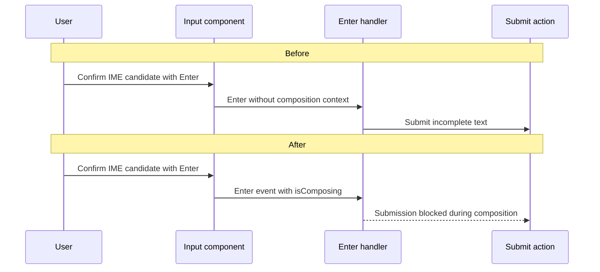
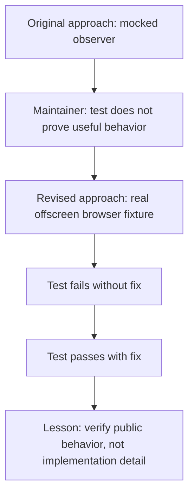
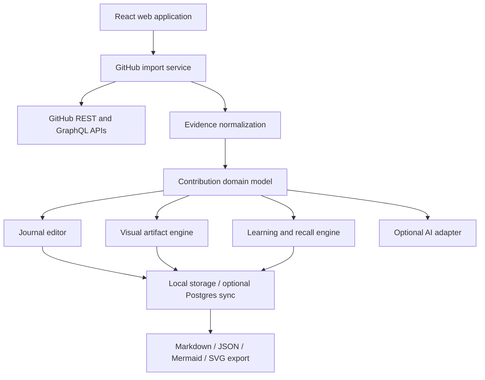

# Open Source Contribution Journal

## Product Vision, Learning System, Visual Design, Technical Architecture, and Build Plan

**Document status:** Product specification for initial open-source development  
**Working title:** Open Source Contribution Journal  
**Primary user:** A developer contributing to unfamiliar open-source repositories with or without AI assistance  
**Initial platform:** Responsive web application, installable later as a PWA  
**Primary stack:** TypeScript and React  
**License recommendation:** Apache-2.0  
**Last updated:** July 2026

---

# 1. Executive Summary

Open Source Contribution Journal is a learning-first companion for people who contribute to open-source software.

A user imports a GitHub issue or pull request. The application gathers the available evidence:

- Issue description and comments
- Pull-request description
- Commits and changed files
- Review comments and requested changes
- CI checks and final status
- Important timestamps and milestones

The user then turns that evidence into durable understanding through:

- A structured technical journal
- Editable visual diagrams
- A problem-to-root-cause map
- A before-and-after execution flow
- A review-evolution timeline
- A personal concept graph
- Retrieval questions and later review sessions
- A polished Markdown export and optional public contribution story

The product is **not** primarily a contribution tracker, GitHub inbox, résumé generator, or AI code generator.

Its central promise is:

> Turn every contribution into knowledge you can explain, remember, and build upon.

The application should be valuable without AI. AI may help organize evidence, suggest diagrams, draft questions, and challenge unsupported claims, but the user remains responsible for understanding and confirming the final record.

---

# 2. The Product Thesis

AI makes it possible to investigate and modify unfamiliar codebases much faster than before. That is useful, but it creates a new problem:

> A developer can complete a change without building a durable mental model of the problem, architecture, solution, or review feedback.

GitHub records activity, but activity is not the same as understanding.

A pull request may contain:

- A real problem
- Several failed hypotheses
- A root cause
- An architectural lesson
- Maintainer feedback
- A better testing strategy
- New concepts
- A useful interview story

Most of that knowledge disappears into a long conversation, an agent transcript, temporary notes, or memory.

Open Source Contribution Journal should preserve that learning while the evidence is still available.

The product should help the user answer:

1. What problem was I trying to solve?
2. How did I reproduce or verify it?
3. Which code paths were involved?
4. What did I initially misunderstand?
5. What was the actual root cause?
6. Why does the solution work?
7. What behavior must remain unchanged?
8. What tests or checks support the change?
9. What did maintainers request?
10. How did the solution evolve after review?
11. Which concepts should I study again?
12. Can I explain this contribution without reading the PR?

---

# 3. Why This Should Exist

## 3.1 Existing tools solve adjacent problems

A current product scan shows several adjacent categories:

### GitHub itself

GitHub provides:

- Contribution calendars and timelines
- Pull-request lists and filters
- Review requests
- CI state
- Merge status
- A cross-repository pull-request dashboard

This is useful for managing work, but it does not convert a contribution into a structured learning artifact.

### Contribution dashboards

Tools such as OpenSauced, OSCT, ShowPR, and similar products focus on:

- Pull-request tracking
- Contribution analytics
- Public profiles
- Repository or contributor insights
- Milestones and activity charts
- Discoverability and hiring signals

These products demonstrate demand for contribution visibility. They do not appear to center the complete learning loop described in this specification.

### Issue discovery tools

Tools such as Pickssue help users find open-source issues and track repositories.

That solves discovery, not understanding after the work begins.

### Repository visualization tools

GitDiagram, Gitvize, CodeBoarding, CodeCanvas, RepoMapr, and similar products visualize codebases or architecture.

These tools focus on the repository as a whole. Open Source Contribution Journal should focus on the **specific slice of architecture involved in one issue or pull request**, combined with the contributor's reasoning and review history.

## 3.2 The product gap

The opportunity is the combination of:

- GitHub evidence
- Human reflection
- Visual explanation
- Review evolution
- Learning retrieval
- A personal concept graph
- Portable Markdown notes
- Optional public proof of understanding

The product should not claim that no similar tool exists. The defensible position is:

> Existing tools track contributions, discover issues, or visualize repositories. This project combines those inputs into a contribution-specific learning and explanation workflow.

## 3.3 Why the timing is good

Open-source maintainers are receiving more high-volume and AI-assisted contributions. GitHub has introduced controls such as limits on concurrent pull requests from outside contributors to help maintainers reduce noise.

That makes contributor accountability more important.

The application should encourage users to produce fewer, better-understood contributions rather than maximize pull-request volume.

---

# 4. Product Positioning

## One-sentence positioning

> A visual learning journal that turns GitHub issues and pull requests into evidence-backed technical understanding.

## Longer positioning

Open Source Contribution Journal helps developers learn by contributing to real projects. It imports the evidence behind an issue or pull request, guides the contributor through root-cause reasoning, creates editable visual maps, preserves maintainer feedback, and schedules short recall sessions so each contribution becomes durable knowledge instead of forgotten activity.

## What makes it different

The product is:

- **Learning-first**, not analytics-first
- **Evidence-first**, not AI-first
- **Contribution-specific**, not a generic repository map
- **Editable**, not a black-box explanation
- **Private by default**
- **Portable through Markdown**
- **Useful during the entire contribution lifecycle**
- **Designed for AI-assisted developers without shaming AI use**

---

# 5. Product Principles

## 5.1 Evidence before explanation

Imported GitHub data should remain distinguishable from user notes and AI-generated interpretation.

The system must preserve provenance.

Every factual claim generated by the system should link to one or more sources such as:

- Issue text
- Issue comment
- Pull-request description
- Commit
- Diff hunk
- Review comment
- Check run
- User-provided command result

## 5.2 The user explains before AI fills

The default learning mode should ask the user to explain the problem or root cause before showing an AI-generated draft.

This prevents the app from becoming another place where the user presses a button and accepts a polished answer.

## 5.3 AI suggestions are drafts, not truth

AI output must be labeled as one of:

- **Verified:** Directly supported by imported evidence
- **User confirmed:** Confirmed by the contributor
- **Inferred:** A reasonable interpretation that still requires verification
- **Unknown:** Not established by available evidence

## 5.4 Visuals must be editable

Automatically generated diagrams are useful starting points, but they can be wrong.

Users must be able to:

- Rename nodes
- Remove nodes
- Add missing nodes
- Change relationships
- Link a node to evidence
- Mark uncertainty
- Export the corrected diagram

## 5.5 The product must work without AI

The non-AI workflow should include:

- GitHub import
- Structured journal template
- Manual diagrams
- Review timeline
- Concept tracking
- Markdown export
- Recall scheduling

AI should improve speed and coaching, not determine whether the application is usable.

## 5.6 Private by default

A technical learning journal may include:

- Incorrect assumptions
- Private reflections
- Security-sensitive observations
- Unpublished designs
- Frustration or confusion
- Private repository information

Nothing becomes public without a deliberate publishing action.

## 5.7 Optimize for completed learning loops

The product should reward:

- Responding to maintainer feedback
- Completing a reflection
- Correcting an earlier misunderstanding
- Revisiting knowledge later
- Explaining a contribution accurately

It should not reward:

- Opening many pull requests
- Generating large diffs
- Artificial streaks
- Number of repositories touched
- Raw lines changed

---

# 6. Target Users

## Persona A: AI-assisted open-source contributor

The user can investigate and implement quickly with coding agents but wants to understand the work well enough to:

- Respond to maintainers
- Defend technical decisions
- Remember the architecture
- Explain the contribution in interviews

## Persona B: Developer learning in public

The user learns technologies by solving actual issues rather than completing isolated tutorials.

They need:

- Structure
- Visual explanation
- A record of progress
- A personal curriculum derived from real work

## Persona C: Experienced developer entering a new domain

The user already understands software engineering but is new to:

- Rust
- Machine learning
- Compilers
- Rendering
- Distributed systems
- A specific framework

The journal helps connect existing knowledge to unfamiliar architecture.

## Persona D: Mentor or educator

Later versions may allow mentors to:

- Review a learner's explanation
- Ask follow-up questions
- Provide concept feedback
- Create contribution reflection templates

## Persona E: Maintainer

Later versions may help maintainers see whether a contributor:

- Understood review feedback
- Documented behavior and testing
- Can explain the root cause
- Is likely to maintain the change

The product must not reduce contributors to an opaque score.

---

# 7. Jobs to Be Done

## Primary job

> When I work on an unfamiliar open-source issue, help me convert the activity into understanding I can explain and remember.

## Supporting jobs

### During investigation

> Help me organize hypotheses, evidence, code paths, and unknowns.

### During implementation

> Help me see which parts of the system are changing and which invariants must remain true.

### During review

> Help me understand maintainer feedback and show how my solution evolved.

### After completion

> Help me create a durable note, visual explanation, and later recall session.

### During job searching

> Help me present a contribution as verifiable proof of engineering ability without exaggerating my role.

---

# 8. The Core Contribution Lifecycle

A contribution should move through explicit stages.



## Stage 1: Imported

The user pastes:

- A GitHub issue URL
- A GitHub pull-request URL
- Or both

The app creates a contribution workspace.

## Stage 2: Investigating

The user records:

- Reproduction
- Hypotheses
- Architecture
- Relevant files
- Unknowns
- Maintainer questions

## Stage 3: Implementing

The user records:

- Selected approach
- Tradeoffs
- Changed files
- Commands run
- Manual checks
- Unverified areas

## Stage 4: Pull request open

The app imports:

- PR body
- Commits
- Changed-file metadata
- Initial checks
- Requested reviewers

## Stage 5: Review

The app tracks:

- Review comments
- Requested changes
- New commits
- Resolved threads
- CI changes
- User responses

## Stage 6: Completed

The contribution becomes completed when it is:

- Merged
- Closed with a clear outcome
- Superseded
- Withdrawn after a documented learning result

A closed PR is not automatically a failure. The journal should preserve what was learned.

## Stage 7: Reflected

The user completes:

- Final root cause
- Final solution
- Review lessons
- Mistakes
- Reusable patterns
- Interview story
- Concept list

## Stage 8: Revisited

The system asks the user to recall important concepts after a delay.

---

# 9. The Core User Loop

```mermaid
flowchart LR
    A[Import issue or PR] --> B[Build evidence ledger]
    B --> C[User explains first]
    C --> D[Generate editable visual draft]
    D --> E[User corrects and confirms]
    E --> F[Track review evolution]
    F --> G[Create final journal]
    G --> H[Export or publish]
    H --> I[Recall later]
    I --> J[Update personal concept graph]
```



The loop should take different amounts of time depending on contribution size.

### Small contribution

Target: 5–10 minutes to complete the journal.

### Medium contribution

Target: 15–25 minutes.

### Complex contribution

The journal can be updated throughout the work rather than completed all at once.

---

# 10. The Truth and Provenance Model

This is one of the most important architectural decisions.

The product should separate four layers.

## 10.1 Evidence

Immutable imported or user-attached material.

Examples:

- Issue body
- Review comment
- Diff hunk
- Check result
- Terminal output
- Screenshot
- User-uploaded note

## 10.2 Claims

Statements derived from evidence.

Examples:

- “The error occurs before the worker sends its first response.”
- “The collapsible component drops the `forceRender` property.”
- “The maintainer requested a test using real observer behavior.”

Every claim contains:

- Claim text
- Claim type
- Confidence state
- Evidence links
- Author: user, AI, or system
- Confirmation status

## 10.3 Reflections

Subjective notes owned by the user.

Examples:

- “I initially assumed the problem was in the parent component.”
- “I did not understand the repository's test fixture architecture.”
- “The maintainer's feedback taught me to test observable behavior instead of implementation details.”

Reflections do not need objective evidence, but they must not be presented publicly as repository facts.

## 10.4 Artifacts

Outputs built from evidence, claims, and reflections.

Examples:

- Diagram
- Timeline
- Quiz
- Markdown note
- Public contribution card
- Interview story

This layered model makes the product more trustworthy and easier to debug.

---

# 11. Core Screens

## 11.1 Dashboard

The dashboard should show:

- Active contributions
- Waiting for review
- Needs user response
- Ready for reflection
- Scheduled learning reviews
- Recently completed contributions
- Concepts currently being learned

Do not make the dashboard primarily a contribution heatmap. GitHub and other tools already provide activity views.

## 11.2 Import screen

Inputs:

- GitHub issue URL
- GitHub pull-request URL
- Optional local repository path for future desktop/CLI integration

The app should detect:

- Repository
- Issue number
- Pull-request number
- Whether the PR closes an issue
- Whether the user authored the PR
- Public or private visibility
- Import permissions available

## 11.3 Contribution workspace

Recommended navigation:

1. Overview
2. Evidence
3. Investigation
4. Visuals
5. Review evolution
6. Journal
7. Practice
8. Publish

## 11.4 Personal knowledge map

The knowledge map should show:

- Concepts
- Repositories
- Contributions
- Technologies
- Repeated mistakes
- Concepts awaiting review
- Relationships across contributions

Example:



## 11.5 Review queue

This is not a GitHub notification inbox.

It should show learning actions:

- Explain this root cause again
- Review this maintainer comment
- Recreate the execution flow from memory
- Answer questions about this concept
- Compare your initial hypothesis with the final cause

---

# 12. The Visual Learning System

The visual system is the feature that can make the product memorable.

## 12.1 Contribution timeline

### Purpose

Show the contribution as a story rather than a static PR.

### Events

- Issue opened
- User began investigation
- Reproduction confirmed
- First commit
- PR opened
- CI failure
- Review requested
- Maintainer comment
- New commit
- Review approved
- PR merged or closed
- Reflection completed

### MVP

A chronological vertical timeline.

### Future

A replay mode that compares the contribution at each revision.

---

## 12.2 Problem-to-solution map

### Purpose

Force a clear separation between symptom, cause, change, and evidence.



### Required nodes

- Symptom
- Reproduction
- Root cause
- Fix
- Validation
- Outcome

### Optional nodes

- Failed hypothesis
- Tradeoff
- Maintainer decision
- Remaining uncertainty

### Unique behavior

Each node can display an evidence badge.

---

## 12.3 Architecture slice map

### Purpose

Show only the part of the repository relevant to the contribution.

Avoid attempting to map the entire repository in version 0.1.

### Node types

- Package
- Module
- File
- Class
- Function
- Component
- API
- Test
- External dependency

### Edge types

- Calls
- Imports
- Renders
- Reads
- Writes
- Emits
- Subscribes
- Validates
- Tests

### MVP behavior

The app suggests nodes from changed files and user-selected files. The user edits the graph.

### Future behavior

Optional static analysis adapters by language.

---

## 12.4 Before-and-after execution flow

### Purpose

Explain behavioral change.



### MVP

Mermaid editor with system-generated draft.

### Future

Animated step-through mode.

---

## 12.5 Change impact map

### Purpose

Show what changed and the expected blast radius.

### Visual groups

- Production files
- Tests
- Documentation
- Configuration
- Generated files

### Indicators

- Added
- Modified
- Deleted
- High uncertainty
- Security sensitive
- Performance sensitive
- Public API

Do not invent semantic impact solely from line counts.

---

## 12.6 Review evolution map

### Purpose

Make maintainer feedback part of the learning record.

Example:



### Important fields

- Feedback
- Contributor interpretation
- Change made
- Evidence after change
- Lesson learned

---

## 12.7 Hypothesis board

### Purpose

Preserve debugging reasoning.

Columns:

- Hypothesis
- Supporting evidence
- Contradicting evidence
- Status
- Next experiment

Statuses:

- Unchecked
- Plausible
- Rejected
- Confirmed
- Partially true

This can become one of the best tools for complex issues.

---

## 12.8 Test and validation matrix

### Purpose

Separate what was validated from what was assumed.

| Behavior | Automated test | Manual check | CI | Verified result |
|---|---|---|---|---|
| Reproduction fails before fix | Yes | Optional | Local | Confirmed |
| Fix resolves reproduction | Yes | Yes | Local | Confirmed |
| Full suite passes | Yes | No | GitHub Actions | Confirmed |
| Performance unchanged | No | No | No | Unknown |

The app must never automatically mark a test as run just because the PR description mentions it without evidence or user confirmation.

---

## 12.9 Concept graph

### Purpose

Turn contributions into a personal curriculum.

Each concept can move through learning states:

```text
Unknown → Encountered → Explained → Applied → Reviewed → Recalled
```

Concept fields:

- Name
- Plain-language explanation
- Technical explanation
- Contributions where used
- Confidence
- Review date
- Related concepts
- Resources
- Questions

---

## 12.10 Interview-story storyboard

### Purpose

Convert the contribution into a concise, honest explanation.

Panels:

1. Context
2. Problem
3. Investigation
4. Decision
5. Implementation
6. Review feedback
7. Result
8. Learning

The public version should link back to the PR and avoid claims that cannot be verified.

---

# 13. The Learning Engine

A journal alone does not guarantee learning.

The application should use active recall, explanation, and feedback.

## 13.1 Explain-before-reveal

Before showing an AI summary, ask:

- What do you believe the root cause was?
- Which file or component was responsible?
- Why did the current test suite not catch it?
- What behavior could your change accidentally break?

The user can skip, but the default should encourage effort first.

## 13.2 Inference prompts, not paraphrase prompts

Avoid weak prompts such as:

> Summarize the pull request.

Prefer:

- Why did the symptom occur only under this condition?
- Which assumption in the original implementation was incorrect?
- What invariant does the fix preserve?
- Why did the maintainer reject the first test?
- What alternative solution was considered and why was it not selected?

## 13.3 Retrieval practice

After completion, generate a small review set.

Recommended schedule:

- 1 day
- 3 days
- 7 days
- 21 days
- Optional 60-day review

Question types:

- Free recall
- Short answer
- Diagram reconstruction
- Identify the missing step
- Compare two approaches
- Explain a maintainer comment
- Predict a failure case

Always provide corrective feedback after an attempt.

## 13.4 Teach-back mode

The user explains the contribution through text or voice.

Suggested prompt:

> Explain the issue to a developer who knows the language but not the repository.

The system checks for missing concepts and unsupported claims but should not assign a fake intelligence score.

## 13.5 Confidence calibration

Before answering, the user selects confidence:

- Guessing
- Partially confident
- Confident
- Can teach it

After feedback, the app records whether confidence matched correctness.

## 13.6 Mistake library

Capture repeated patterns:

- Misread async lifecycle
- Tested implementation instead of behavior
- Missed an existing helper
- Assumed a type was runtime validation
- Ignored platform-specific behavior
- Changed too much at once
- Failed to read contribution instructions

The mistake library should be private by default.

---

# 14. AI Responsibilities and Boundaries

## 14.1 Good uses of AI

AI may:

- Extract candidate facts from GitHub evidence
- Suggest a root-cause map
- Suggest architecture nodes
- Generate Mermaid drafts
- Draft retrieval questions
- Find contradictions in the journal
- Ask Socratic questions
- Suggest concepts to study
- Convert a final journal into a concise public story
- Translate the user's own explanation

## 14.2 AI must not

AI must not:

- Claim a command ran when there is no evidence
- Claim a PR merged when it did not
- Invent maintainer feedback
- Present an inference as fact
- Publish private material automatically
- Score a developer's worth
- Generate deceptive contribution statistics
- Send comments to GitHub without confirmation
- ingest private repository code into an external provider without explicit consent

## 14.3 Source-linked generation

Every generated paragraph should be able to expose its sources.

Example:

```text
Claim: The handler could not inspect IME composition state.
Sources:
- Template omitted `$event`
- Handler signature had no KeyboardEvent
- Maintainer-linked reproduction
Confidence: Verified
```

## 14.4 Provider abstraction

The project should support an adapter interface.

```ts
export interface LearningAssistant {
  extractClaims(input: EvidenceBundle): Promise<ClaimDraft[]>;
  proposeDiagram(input: ContributionContext): Promise<DiagramDraft>;
  generateQuestions(input: ConfirmedKnowledge): Promise<PracticeQuestion[]>;
  critiqueExplanation(input: ExplanationReviewInput): Promise<ExplanationFeedback>;
}
```

Possible providers later:

- OpenAI
- Anthropic
- Google
- OpenRouter
- Local Ollama
- No-AI deterministic mode

Do not build every provider in version 0.1.

---

# 15. MVP Scope

## Product goal for version 0.1

A user can paste a public GitHub issue or pull-request URL and produce an evidence-backed visual learning note that exports cleanly to Markdown.

## Required features

### 1. Public GitHub import

Import:

- Repository metadata
- Issue or pull-request title and body
- Author and state
- Comments
- Changed-file metadata
- Reviews and review comments
- Basic timeline events
- Check-run summaries when available

### 2. Evidence ledger

Display imported evidence with source links.

### 3. Structured journal editor

Sections:

- Problem
- Reproduction
- Architecture
- Investigation
- Root cause
- Solution
- Validation
- Review feedback
- Learning
- Mistakes
- Interview story

### 4. Three visualizations

Version 0.1 should implement only:

- Contribution timeline
- Problem-to-solution map
- Architecture slice map

### 5. Manual claim confirmation

Users can mark claims:

- Verified
- Confirmed
- Inferred
- Unknown

### 6. Markdown export

Export a complete note compatible with `NotesOpenSourceFiles`.

### 7. Local draft persistence

Drafts survive browser refresh through IndexedDB.

### 8. One optional AI adapter

The product must still function when no AI key is configured.

## Strongly recommended version 0.1 feature

### Coach mode

Before generating the root-cause draft, ask the user three questions.

This expresses the product's identity immediately.

---

# 16. Explicit Non-Goals for Version 0.1

Do not build:

- Private repository support
- GitHub write permissions
- Automatic PR creation
- Automatic GitHub comments
- A social feed
- Recruiter skill scores
- Contributor rankings
- Gamified PR volume
- Full repository semantic indexing
- Automatic code execution
- A cloud coding agent
- Team workspaces
- GitLab support
- Mobile native apps
- Real-time collaboration
- Billing
- A full spaced-repetition algorithm
- Video export
- Browser extension
- IDE extension

The first release should prove the learning loop.

---

# 17. Version Roadmap

## Version 0.1 — Personal learning journal

- Public GitHub import
- Evidence ledger
- Journal
- Three visuals
- Markdown export
- Local persistence
- Optional AI coach

## Version 0.2 — Contribution lifecycle

- GitHub sign-in
- Contribution dashboard
- Review synchronization
- Practice queue
- Concept graph
- Public/private field controls
- Shareable contribution page

## Version 0.3 — GitHub App

- Read-only private repository support
- Webhook synchronization
- Fine-grained repository installation
- CI and review updates
- User-controlled data deletion
- Optional server sync

## Version 0.4 — Visual depth

- Before/after sequence diagrams
- Review replay
- Hypothesis board
- Validation matrix
- Diagram templates
- SVG and PNG export

## Version 1.0 — Open-source learning platform

- GitHub, GitLab, and Forgejo adapters
- Plugin system
- Mentor mode
- Organization or classroom deployments
- Shared curriculum templates
- Local-model support
- Self-hosting documentation
- Accessibility audit
- Stable data export format

---

# 18. Recommended Technical Architecture

## 18.1 Monorepo

```text
open-source-contribution-journal/
├── apps/
│   └── web/
├── packages/
│   ├── domain/
│   ├── github/
│   ├── evidence/
│   ├── journal/
│   ├── visualizations/
│   ├── learning/
│   ├── ai/
│   ├── export/
│   ├── ui/
│   └── config/
├── examples/
│   └── sample-contributions/
├── docs/
├── CONTRIBUTING.md
├── SECURITY.md
├── CODE_OF_CONDUCT.md
└── LICENSE
```

## 18.2 Recommended stack

### Application

- Next.js
- React
- TypeScript
- Zod
- pnpm workspaces
- Turborepo

### GitHub integration

- Octokit
- REST API first
- GraphQL only where it reduces request volume meaningfully

### Persistence

Version 0.1:

- IndexedDB
- Dexie or a small typed storage wrapper
- Exportable JSON backup

Later:

- PostgreSQL
- Drizzle ORM
- Supabase-hosted Postgres is acceptable but the schema should remain portable

### Visuals

- React Flow / XYFlow
- ELK.js for auto-layout
- Mermaid for portable text diagrams
- SVG export

### Journal editor

Start with Markdown.

Options:

- CodeMirror-based Markdown editor
- MDXEditor
- Milkdown

Avoid building a Notion clone before validating the product.

### Testing

- Vitest
- React Testing Library
- Playwright
- Contract fixtures for GitHub API payloads

### Styling

- Accessible component system
- Tailwind CSS or equivalent
- Dark and light modes
- Keyboard-first interactions

## 18.3 Why web-first

A web application provides:

- Easy sharing
- GitHub integration
- Cross-platform use
- Fast iteration
- Public examples
- Installable PWA path
- Easier open-source onboarding

A CLI can be added later for developers who prefer local workflows.

---

# 19. High-Level Architecture



---

# 20. GitHub Integration Design

## 20.1 Version 0.1 public import

Public GitHub resources can be read without full installation, although authentication improves rate limits.

The importer should fetch:

- Pull request
- Linked issue when detected
- Issue comments
- PR reviews
- Review comments
- Commits
- Changed files
- Timeline events
- Check runs
- Repository metadata

## 20.2 GitHub App later

GitHub generally recommends GitHub Apps over OAuth Apps because GitHub Apps provide:

- Fine-grained permissions
- Repository-level installation choices
- Short-lived tokens
- Built-in webhooks
- Better security boundaries

Recommended initial permissions:

- Metadata: read
- Issues: read
- Pull requests: read
- Checks: read
- Contents: no access by default

Optional permission later:

- Contents: read, only when the user explicitly enables code-context features for selected repositories

No write permission should be required for the core product.

## 20.3 Webhooks

Subscribe only to required events:

- Issues
- Issue comments
- Pull requests
- Pull-request reviews
- Pull-request review comments
- Check runs
- Installation changes

Use:

- Webhook signature verification
- Idempotency keys
- Delivery logging
- Retry handling
- Minimal payload retention

## 20.4 Rate-limit strategy

- Prefer webhooks over polling
- Cache immutable evidence
- Use conditional requests
- Back off on secondary rate limits
- Allow manual refresh
- Avoid repeatedly fetching complete diffs

---

# 21. Proposed Domain Model

## 21.1 Contribution

```ts
type ContributionStage =
  | "imported"
  | "investigating"
  | "implementing"
  | "pull_request_open"
  | "in_review"
  | "completed"
  | "reflected"
  | "revisited";

interface Contribution {
  id: string;
  userId?: string;
  repository: RepositoryRef;
  issue?: GitHubItemRef;
  pullRequest?: GitHubItemRef;
  stage: ContributionStage;
  visibility: "private" | "unlisted" | "public";
  title: string;
  createdAt: string;
  updatedAt: string;
}
```

## 21.2 Evidence artifact

```ts
type EvidenceKind =
  | "issue_body"
  | "issue_comment"
  | "pr_body"
  | "commit"
  | "diff_hunk"
  | "review"
  | "review_comment"
  | "check_run"
  | "timeline_event"
  | "terminal_output"
  | "screenshot"
  | "user_note";

interface EvidenceArtifact {
  id: string;
  contributionId: string;
  kind: EvidenceKind;
  sourceUrl?: string;
  sourceId?: string;
  filePath?: string;
  lineStart?: number;
  lineEnd?: number;
  commitSha?: string;
  body: string;
  author?: string;
  occurredAt?: string;
  importedAt: string;
  contentHash: string;
}
```

## 21.3 Claim

```ts
type ClaimStatus = "verified" | "user_confirmed" | "inferred" | "unknown";

interface Claim {
  id: string;
  contributionId: string;
  text: string;
  category:
    | "problem"
    | "reproduction"
    | "architecture"
    | "root_cause"
    | "solution"
    | "validation"
    | "review"
    | "outcome";
  status: ClaimStatus;
  createdBy: "user" | "ai" | "system";
  evidenceIds: string[];
  userConfirmedAt?: string;
}
```

## 21.4 Reflection

```ts
interface Reflection {
  id: string;
  contributionId: string;
  category:
    | "initial_assumption"
    | "mistake"
    | "learning"
    | "maintainer_feedback"
    | "reusable_pattern"
    | "interview_story"
    | "follow_up";
  body: string;
  visibility: "private" | "public";
}
```

## 21.5 Diagram

```ts
interface Diagram {
  id: string;
  contributionId: string;
  type:
    | "timeline"
    | "problem_solution"
    | "architecture_slice"
    | "sequence"
    | "review_evolution"
    | "hypothesis_board"
    | "concept_graph";
  title: string;
  nodes: DiagramNode[];
  edges: DiagramEdge[];
  mermaidSource?: string;
  version: number;
  verifiedByUser: boolean;
}
```

## 21.6 Concept

```ts
type ConceptState =
  | "encountered"
  | "explained"
  | "applied"
  | "reviewed"
  | "recalled";

interface Concept {
  id: string;
  name: string;
  description?: string;
  state: ConceptState;
  confidence: 1 | 2 | 3 | 4;
  nextReviewAt?: string;
}
```

---

# 22. Suggested Routes

```text
/                         Landing page
/import                   Import issue or pull request
/dashboard                Personal learning dashboard
/contributions/:id        Contribution overview
/contributions/:id/evidence
/contributions/:id/investigation
/contributions/:id/visuals
/contributions/:id/review
/contributions/:id/journal
/contributions/:id/practice
/contributions/:id/publish
/knowledge                Personal concept graph
/review                    Scheduled recall queue
/settings/github
/settings/privacy
```

---

# 23. Markdown Export Format

The exported note should be readable without the application.

```md
# Project — Issue #123 — Contribution Title

## Links

- Repository:
- Issue:
- Pull request:

## Outcome

- Status:
- Started:
- Completed:

## Problem

## Reproduction

## Architecture

## Investigation

## Root Cause

## Solution

## Changed Files

## Validation

## Manual Verification

## Review Feedback

## What Changed After Review

## What I Learned

## Mistakes and Incorrect Assumptions

## Reusable Patterns

## Concepts

## Interview Story

## Follow-Up Opportunities

## Evidence Index
```

The export should include Mermaid blocks when the user selects portable diagrams.

---

# 24. Privacy and Security

## 24.1 Core privacy rule

Do not store raw repository code unless necessary and explicitly authorized.

For public PRs, store:

- GitHub metadata
- Changed-file names and statistics
- Selected diff hunks used as evidence
- User-created notes
- Generated artifacts

## 24.2 Private repositories

Private repository support should wait until:

- GitHub App permissions are narrowly defined
- Data deletion exists
- External AI transmission is opt-in
- Encryption and logging have been reviewed
- A threat model exists

## 24.3 Prompt injection

Repository content is untrusted input.

Issue bodies, comments, code, and documentation may contain instructions intended to manipulate an AI model.

The AI layer must:

- Treat imported content as data
- Use a strict system boundary
- Never execute instructions from imported content
- Never reveal secrets or credentials
- Avoid tool calls unless the user explicitly requests them
- Clearly separate repository text from application instructions

## 24.4 Markdown and diagram safety

- Sanitize rendered Markdown
- Disable unsafe HTML by default
- Sanitize SVG
- Do not allow `javascript:` URLs
- Limit diagram complexity
- Prevent denial-of-service through oversized imports

## 24.5 Secrets

- Never store personal access tokens in browser local storage
- Prefer GitHub App tokens
- Use short-lived tokens
- Redact secrets found in imported text
- Do not include environment variables in exports
- Add secret scanning to the repository

## 24.6 User controls

Users must be able to:

- Delete a contribution
- Delete all account data
- Export all data
- Disable AI providers
- Revoke GitHub access
- Select public fields individually

---

# 25. Open-Source Strategy

## 25.1 License

Recommended: **Apache License 2.0**

Reasons:

- Permissive for individuals and companies
- Explicit patent grant
- Friendly to integrations and plugins
- Suitable for a developer-tool ecosystem

Do not introduce dual licensing in the first release.

## 25.2 Repository quality from day one

Create:

- README.md
- CONTRIBUTING.md
- CODE_OF_CONDUCT.md
- SECURITY.md
- LICENSE
- CHANGELOG.md
- Architecture decision records
- Issue templates
- Pull-request template
- Good-first-issue labels
- Feature-request template
- Threat-model document before private repo support

## 25.3 Contribution surfaces

The project can attract contributors through independent areas:

- GitHub importer
- GitLab adapter
- Forgejo adapter
- Diagram types
- Export templates
- AI providers
- Local model support
- Accessibility
- Translations
- Learning-question templates
- Data visualization
- Browser extension
- CLI
- IDE integrations
- Self-hosting
- Documentation
- Example journals

## 25.4 Governance

Initial governance:

- Benevolent maintainer model
- Public roadmap
- Architecture discussions before large PRs
- Small scoped issues
- Transparent release notes
- Clear AI contribution policy

## 25.5 Suggested AI contribution policy

Contributors may use AI tools, but remain responsible for:

- Understanding the submitted change
- Reviewing the final diff
- Running required checks
- Responding to maintainers
- Disclosing AI assistance when the target repository requires it
- Avoiding copyrighted or incompatible source material
- Not submitting unverified generated claims

This product should model the behavior it encourages.

---

# 26. Community and Product Ethics

## Do not create a contributor score

A numeric “quality score” would be misleading and could punish:

- Small but meaningful work
- Documentation
- Accessibility fixes
- Long review cycles
- Closed PRs with valuable learning
- Contributors working in difficult repositories

## Do not rank people by volume

Volume can reflect:

- Spam
- Automated changes
- Tiny edits
- Repository policies
- Available free time

## Better recognition

Celebrate behaviors such as:

- Closed the learning loop
- Responded to review
- Corrected an assumption
- Added reproducible evidence
- Recalled the concept later
- Helped another contributor
- Documented a negative result

These should be optional and private unless the user publishes them.

---

# 27. Public Contribution Story

A public contribution page can contain:

- Repository and PR link
- Contribution status
- Plain-language problem
- Technical root cause
- Visual flow
- Important files
- Validation
- Review evolution
- Concepts learned
- Final reflection
- What the contributor would do differently

Private content remains excluded.

## Public card example

```text
Contribution: Preserve IME composition in Enter handlers
Project: Example Agent UI
Impact: Prevents incomplete CJK input from being submitted
Concepts: IME composition, keyboard events, Angular handlers, accessibility
Evidence: PR, tests, review comments
Outcome: Open / merged / closed
```

No unverifiable skill score should appear.

---

# 28. Success Metrics

## User value metrics

- Percentage of imported contributions with completed root-cause explanation
- Percentage with at least one verified visual
- Time required to produce a useful journal
- Percentage of maintainer feedback recorded
- Recall accuracy after 7 and 21 days
- Number of concepts connected across contributions
- User-reported confidence calibration
- Markdown export usage

## Product health metrics

- Import success rate
- API error rate
- Diagram edit rate
- Evidence-link coverage
- AI claim rejection or correction rate
- Data deletion success rate
- Accessibility test status

## Metrics to avoid optimizing

- Pull requests opened
- Lines of code changed
- Daily activity streak
- Number of AI generations
- Number of repositories touched
- Public profile views alone

---

# 29. Dogfooding Plan

The creator should be the first serious user.

Use five contributions with different learning patterns.

## Suggested dogfood set

1. A contribution with significant maintainer feedback
2. A contribution with an accessibility or international input issue
3. A contribution with a subtle root cause
4. A contribution focused on tests or security
5. A contribution that was closed or changed direction

For each contribution, measure:

- Import completeness
- Time to build the journal
- Whether the generated diagram was accurate
- Which evidence was missing
- Whether review feedback was easy to follow
- Whether the 7-day recall questions were useful

The product should be adjusted based on actual use before inviting many users.

---

# 30. Four-Week MVP Plan

## Week 1: Domain and import

Deliver:

- Monorepo
- Domain types
- GitHub URL parser
- Public issue import
- Public PR import
- Fixture-based tests
- Local persistence
- Basic contribution overview

## Week 2: Evidence and journal

Deliver:

- Evidence ledger
- Claim model
- Journal editor
- Claim confirmation states
- Markdown export
- Sample contribution fixtures

## Week 3: Visual learning

Deliver:

- Timeline
- Problem-to-solution map
- Architecture slice map
- Editable nodes and edges
- Mermaid export
- SVG export if time permits

## Week 4: Coach mode and launch

Deliver:

- Explain-before-reveal prompts
- One AI provider adapter
- Deterministic no-AI mode
- Three-question practice review
- README
- Contribution guide
- Security policy
- Public demo
- Version 0.1 release

If the schedule slips, remove AI before removing evidence, journaling, or editing.

---

# 31. Initial Development Backlog

## Epic A — Foundation

### A1. Create monorepo

Acceptance criteria:

- Web app runs
- Shared packages compile
- Tests run from root
- Lint and type checking run from root

### A2. Define domain schemas

Acceptance criteria:

- Contribution, evidence, claim, reflection, diagram, and concept schemas exist
- Schemas are validated with Zod
- JSON fixtures pass validation

### A3. Local persistence

Acceptance criteria:

- Contribution drafts survive refresh
- Data can be exported as JSON
- Data can be deleted

## Epic B — GitHub import

### B1. Parse GitHub URLs

Support:

- Issue URL
- Pull-request URL
- Repository URL with item number rejected clearly

### B2. Import issue

Acceptance criteria:

- Title, body, comments, labels, author, state, and timestamps imported

### B3. Import pull request

Acceptance criteria:

- PR metadata
- Reviews
- Review comments
- Commits
- Changed files
- Timeline
- Check summaries

### B4. Normalize evidence

Acceptance criteria:

- Every artifact has stable source identity
- Re-import does not create duplicates
- Content changes produce new evidence versions or hashes

## Epic C — Journal

### C1. Structured Markdown editor

### C2. Evidence links inside journal

### C3. Claim confirmation controls

### C4. Markdown export

## Epic D — Visuals

### D1. Contribution timeline

### D2. Problem-to-solution map

### D3. Architecture slice map

### D4. Mermaid export

## Epic E — Learning

### E1. Explain-before-reveal prompts

### E2. Three-question recall session

### E3. Concept extraction and manual editing

### E4. Review schedule

## Epic F — Open-source readiness

### F1. README

### F2. Contribution guide

### F3. Security policy

### F4. Code of conduct

### F5. Issue and PR templates

---

# 32. Definition of Done for Version 0.1

Version 0.1 is complete when:

1. A user can paste a public GitHub PR URL.
2. The app imports the PR, review discussion, changed files, and checks.
3. The app creates an evidence ledger without duplicate imports.
4. The user can write a structured contribution journal.
5. The user can link claims to evidence.
6. The user can distinguish verified facts from inferences.
7. The app renders an editable contribution timeline.
8. The app renders an editable problem-to-solution map.
9. The app renders an editable architecture slice.
10. The app exports a readable Markdown file.
11. The application works without an AI key.
12. Optional AI output is labeled and source-linked.
13. Drafts persist locally.
14. The user can delete all local data.
15. The repository includes open-source community and security files.
16. At least three real contributions have been dogfooded end to end.
17. Core flows pass automated and manual accessibility checks.
18. No GitHub write permission is requested.

---

# 33. Recommended Landing Page Copy

## Headline

**Turn every pull request into knowledge you keep.**

## Subheadline

Import a GitHub issue or PR, map the problem and solution visually, preserve review feedback, and create an evidence-backed learning journal you can revisit or share.

## Primary action

**Import a contribution**

## Supporting points

- Understand the code, not just the diff
- See how your solution evolved through review
- Build a personal map of concepts learned
- Export everything to Markdown
- Works without AI
- Private by default
- Open source

---

# 34. README Draft

```md
# Open Source Contribution Journal

Turn GitHub issues and pull requests into durable technical understanding.

Open Source Contribution Journal imports the evidence behind a contribution and helps you build:

- A structured engineering journal
- Editable problem and architecture maps
- A review-evolution timeline
- A personal concept graph
- Recall questions
- Portable Markdown notes

## Why

AI can help developers move quickly through unfamiliar repositories, but activity is not the same as understanding.

This project helps contributors preserve the problem, root cause, solution, validation, maintainer feedback, mistakes, and lessons behind each contribution.

## Principles

- Evidence before AI
- Private by default
- Useful without AI
- Editable visual explanations
- Human accountability
- No contributor rankings

## Status

Early development. The first release focuses on public GitHub issues and pull requests, local storage, visual learning maps, and Markdown export.
```

---

# 35. Master Prompt for Claude Code / Fable 5

Paste the specification file into the development workspace and use the following prompt.

```text
You are the lead engineer for a new open-source project named Open Source Contribution Journal.

The complete product specification is in:

OPEN_SOURCE_CONTRIBUTION_JOURNAL_SPEC.md

Read the entire specification before changing code.

Your first task is to implement only the version 0.1 foundation. Do not attempt the complete long-term roadmap.

Core product rule:

This is a learning-first, evidence-first application. It is not a generic GitHub analytics dashboard and not an AI pull-request generator.

Implementation priorities:

1. Public GitHub issue and pull-request URL import
2. Normalized evidence ledger with provenance
3. Structured Markdown journal
4. Claim states: verified, user-confirmed, inferred, unknown
5. Editable contribution timeline
6. Editable problem-to-solution map
7. Editable architecture-slice map
8. Markdown and Mermaid export
9. IndexedDB local persistence
10. Full functionality without an AI provider

Technical direction:

- TypeScript
- React
- Next.js
- pnpm workspaces
- Turborepo
- Zod
- Octokit
- React Flow / XYFlow
- ELK.js
- Mermaid
- Vitest
- Playwright

Create this monorepo structure:

apps/web
packages/domain
packages/github
packages/evidence
packages/journal
packages/visualizations
packages/learning
packages/ai
packages/export
packages/ui

Before implementing product features:

1. Create an implementation plan.
2. Create architecture decision records for:
   - evidence and provenance model
   - local persistence
   - GitHub import boundaries
   - visual graph representation
   - optional AI provider abstraction
3. Define Zod schemas and tests.
4. Create realistic GitHub API fixtures.
5. Establish linting, type checking, unit tests, and E2E tests.

Constraints:

- Do not request GitHub write permissions.
- Do not build private repository support.
- Do not store personal access tokens in browser storage.
- Do not add billing, social feeds, rankings, or gamification.
- Do not build a full-repository semantic index.
- Do not make AI mandatory.
- Do not invent test results or evidence.
- Do not automatically publish user content.
- Sanitize Markdown and diagrams.
- Treat repository content as untrusted input.
- Keep modules small enough for outside contributors to understand.
- Prefer focused, testable functionality over speculative abstraction.

Development sequence:

Phase 1:
- repository setup
- domain schemas
- fixture-driven GitHub import
- URL parser
- local persistence
- contribution overview

Phase 2:
- evidence ledger
- structured journal
- claim confirmation
- Markdown export

Phase 3:
- timeline
- problem-to-solution map
- architecture-slice map
- Mermaid export

Phase 4:
- explain-before-reveal flow
- optional AI adapter
- simple recall questions
- documentation and public release

After each phase:

- Run tests
- Run type checking
- Run linting
- Update CHANGELOG.md
- Update implementation notes
- Record remaining limitations honestly

Do not open a pull request or publish anything automatically.

Begin by creating the implementation plan and the architecture decision records. Then implement Phase 1 only.
```

---

# 36. Product Decisions That Should Not Be Reopened Without Evidence

1. The product is learning-first, not analytics-first.
2. Version 0.1 supports public GitHub data only.
3. AI is optional.
4. All AI-generated factual claims require provenance.
5. Users edit and confirm visuals.
6. No contributor score.
7. No GitHub write permission in version 0.1.
8. Markdown export is a core feature, not an afterthought.
9. The application must be useful for closed and unmerged PRs.
10. The creator dogfoods the full workflow before expanding scope.

---

# 37. Open Questions for Later

These should not block version 0.1.

- Should public contribution pages support comments?
- Should journals be stored in a dedicated GitHub repository?
- Should the app create commits containing exported notes?
- How should private-repository snippets be encrypted?
- Should concept review use a full spaced-repetition algorithm?
- Should mentors be able to leave private feedback?
- Should repositories publish custom reflection templates?
- Should maintainers be able to verify a public contribution story?
- Should there be a browser extension beside GitHub?
- Should visual artifacts support video replay?
- Should local repository analysis be offered through a desktop helper?
- Should GitHub Discussions be imported?
- Should project-specific AI policies be displayed during import?

---

# 38. Research and Design Notes

## Competitive landscape

Current adjacent products include contribution analytics and showcase tools, issue-discovery tools, and repository-visualization tools. The product should remain differentiated by connecting GitHub evidence to reflection, review evolution, visual understanding, and later recall.

## GitHub platform design

GitHub exposes APIs for pull requests, reviews, review comments, timeline events, and check runs. GitHub Apps are generally preferred over OAuth Apps for integrations because they support fine-grained permissions, repository selection, short-lived tokens, and built-in webhooks.

## Learning design

Research on learning supports using retrieval and feedback rather than relying only on rereading. Research on self-explanation is more nuanced: explanation can support deeper understanding, especially when learners generate valid inferences and connect steps to principles, but generic “explain this” prompts should not be assumed to guarantee learning.

Therefore the application should:

- Ask specific inferential questions
- Require source evidence
- Provide corrective feedback
- Use later recall
- Treat diagrams as editable explanations
- Avoid assuming that a polished summary proves understanding

---

# 39. References

Competitive and platform references current during the July 2026 product scan:

- GitHub contribution profile documentation: https://docs.github.com/en/account-and-profile/how-tos/contribution-settings/viewing-contributions-on-your-profile
- GitHub pull-request dashboard announcement: https://github.blog/changelog/2026-07-09-new-pull-requests-dashboard-is-now-generally-available/
- GitHub pull-request limits for outside contributors: https://github.blog/changelog/2026-06-17-limit-open-pull-requests-for-users-without-write-access/
- GitHub explanation of pull-request limits: https://github.blog/open-source/maintainers/how-pull-request-limits-are-cutting-down-the-noise/
- GitHub Apps versus OAuth Apps: https://docs.github.com/en/enterprise-cloud@latest/apps/oauth-apps/building-oauth-apps/differences-between-github-apps-and-oauth-apps
- GitHub App best practices: https://docs.github.com/en/apps/creating-github-apps/about-creating-github-apps/best-practices-for-creating-a-github-app
- GitHub pull-request review API: https://docs.github.com/en/rest/pulls/reviews
- GitHub timeline events API: https://docs.github.com/en/rest/issues/timeline
- OpenSauced: https://opensauced.com/
- OSCT contribution tracker: https://osct.onrender.com/
- ShowPR: https://show-pr.vercel.app/
- Pickssue: https://pickssue.dev/
- GitDiagram: https://gitdiagram.com/
- Gitvize: https://gitvize.com/
- CodeBoarding: https://github.com/CodeBoarding/CodeBoarding

Learning references:

- Chi et al., Self-Explanations: How Students Study and Use Examples in Learning to Solve Problems: https://doi.org/10.1207/s15516709cog1302_1
- Ainsworth and Loizou, The Effects of Self-Explaining When Learning with Text or Diagrams: https://doi.org/10.1207/s15516709cog2704_5
- Agarwal, Nunes, and Blunt, Retrieval Practice Consistently Benefits Student Learning: https://doi.org/10.1007/s10648-021-09595-9
- Carpenter, Pan, and Butler, The Science of Effective Learning with Spacing and Retrieval Practice: https://doi.org/10.1038/s44159-022-00089-1
- Harders and Ebersbach, No Causal Self-Explanation Effect for Factual Knowledge: https://doi.org/10.1002/acp.70174

---

# 40. Final Recommendation

Build this project.

It has several qualities that make it unusually strong:

- You are already the target user.
- You can test it every day.
- It supports your open-source career strategy.
- It encourages understanding rather than shallow AI dependence.
- It has meaningful visual differentiation.
- It can be useful before it becomes large.
- It offers many independent contribution areas.
- It produces public proof of work without becoming a résumé gimmick.
- It can remain open source and self-hostable.
- It has a clear version 0.1 that can be shipped.

The most important product decision is to resist turning it into a generic GitHub dashboard.

The center of the product should always remain:

> Evidence → explanation → visual understanding → review → recall.
